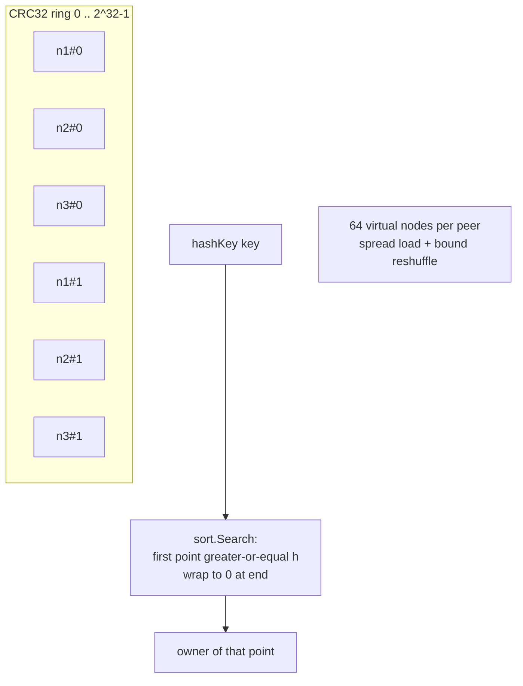
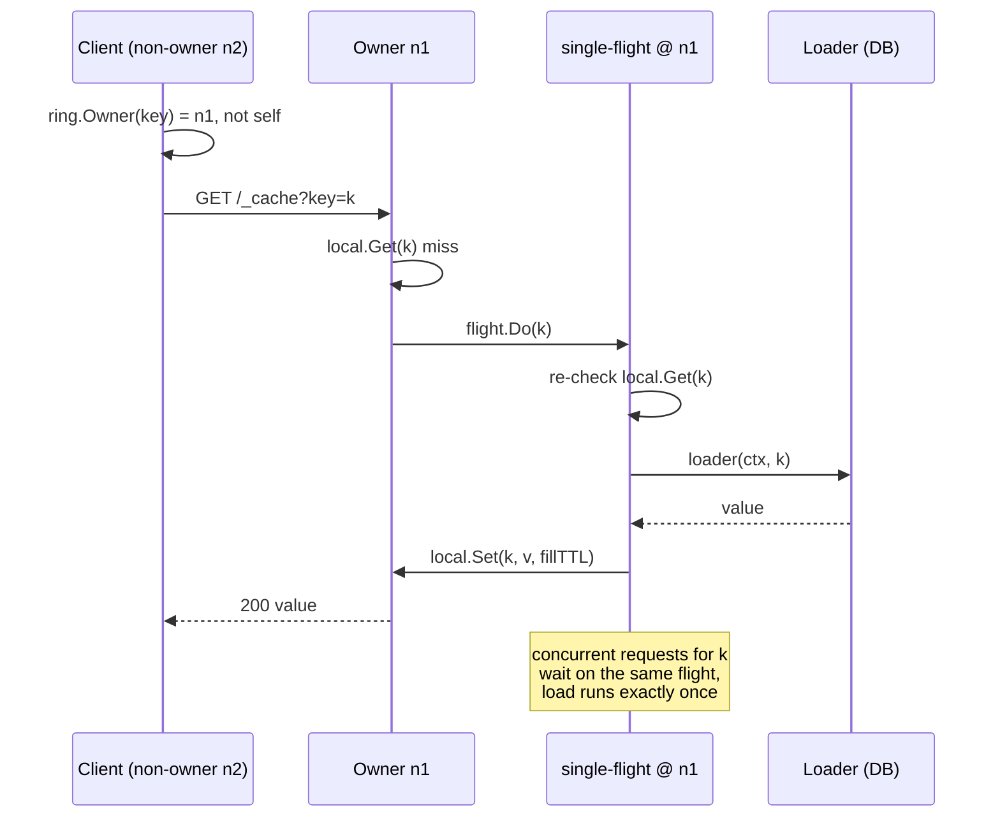

# cache-cluster


[](https://pkg.go.dev/github.com/ubgo/cache-cluster) [](https://goreportcard.com/report/github.com/ubgo/cache-cluster) [](https://github.com/ubgo/cache-cluster/actions/workflows/test.yml) [](https://github.com/ubgo/cache-cluster/actions/workflows/lint.yml)  [](https://github.com/ubgo/cache-cluster/tags) [](./LICENSE) 


Distributed peer-aware cache for Go: consistent hashing, groupcache-style.

`cache-cluster` adds peer-aware distribution on top of any [`github.com/ubgo/cache`](https://github.com/ubgo/cache) backend. A **consistent-hash ring** with virtual nodes deterministically assigns every key to one owning node; reads for keys you do not own are proxied over **HTTP** to their owner; the owner fills a miss exactly once via your loader, deduped by **single-flight**. This is the groupcache pattern expressed through the ubgo/cache interface — a hot key is loaded once cluster-wide, not once per node and not once per concurrent request.

> **Documentation:** a full per-feature cookbook with use cases and runnable snippets for the Ring, Node, options, and the peer-fill + single-flight semantics lives in [`docs/README.md`](docs/README.md).

## Why cache-cluster

- **One fill per hot key, cluster-wide.** Ownership routing plus single-flight at the owner collapses a thundering herd into a single backend load.
- **Minimal reshuffle on membership change.** Consistent hashing means adding or removing a node only moves that node's share of keys, not the whole keyspace.
- **Bring your own storage.** Any `cache.Cache` (in-memory, Redis, …) is the local backend; clustering is a thin layer on top.
- **No third-party dependencies.** Standard library HTTP plus the ubgo/cache contract. The core and this module are dependency-free.
- **Explicit, predictable membership.** Peers are configured, not gossiped — no surprise topology changes.

## Features

- Consistent-hash ring with configurable virtual nodes per peer (`NewRing`).
- Owner-routed `Get` / `Set` / `Del` / `Has`.
- Read-through `Loader` invoked only at the owning node.
- Single-flight de-duplication of concurrent fills for the same key at the owner.
- `Handler()` exposes a minimal `GET/PUT/DELETE /_cache?key=…` peer protocol.
- Pluggable HTTP client, fill TTL, and explicit peer map.

## Install

```bash
go get github.com/ubgo/cache-cluster
```

Requires Go 1.24+.

## Quick start

```go
package main

import (
	"context"
	"net/http"

	clustercache "github.com/ubgo/cache-cluster"
	memcache "github.com/ubgo/cache-mem"
)

func main() {
	local := memcache.New()

	node := clustercache.New("n1", local,
		clustercache.WithPeers(map[string]string{
			"n1": "http://10.0.0.1:8080",
			"n2": "http://10.0.0.2:8080",
			"n3": "http://10.0.0.3:8080",
		}),
		clustercache.WithLoader(func(ctx context.Context, key string) ([]byte, error) {
			return db.Load(ctx, key)
		}),
	)
	defer node.Close()

	http.Handle("/_cache", node.Handler()) // peers reach each other here
	go http.ListenAndServe(":8080", nil)

	v, err := node.Get(context.Background(), "user:42") // owner-routed, filled once
	_ = v
	_ = err
}
```

## Architecture

### The consistent-hash ring



### Peer-fill request sequence



## Detailed usage

### `Ring` — consistent-hash ring

The ring is usable standalone (it is exported) and is also what `Node` uses internally.

#### `NewRing(replicas int, peers ...string) *Ring`

Builds a ring with `replicas` virtual nodes per peer. `replicas <= 0` defaults to 64. More virtual nodes spread keys more evenly and reduce the variance of how many keys move when membership changes.

```go
r := clustercache.NewRing(128, "n1", "n2", "n3")
```

#### `(*Ring) Add(peer string)`

Inserts a peer and its virtual nodes (idempotent — re-adding an existing peer is a no-op). Safe for concurrent use.

```go
r.Add("n4")
```

#### `(*Ring) Remove(peer string)`

Drops a peer and all its virtual nodes. Keys owned by the removed peer redistribute to the remaining peers; **keys owned by other peers do not move** (the no-rebalance-on-remove property of consistent hashing).

```go
r.Remove("n2")
```

#### `(*Ring) Owner(key string) string`

Returns the peer that owns `key`, or `""` if the ring is empty. The owner is the first virtual-node point clockwise from `hashKey(key)`, wrapping around the end of the ring.

```go
who := r.Owner("user:42") // e.g. "n3"
```

#### `(*Ring) Peers() []string`

Returns current membership (unordered).

```go
for _, p := range r.Peers() {
	fmt.Println(p)
}
```

### `Node` — a cluster member

#### `New(self string, local cache.Cache, opts ...Option) *Node`

Builds a node identified by `self`, backed by a local `cache.Cache`. The node's own id is added to its ring immediately so a single-node cluster works before any peers are configured.

```go
node := clustercache.New("n1", memcache.New())
```

#### `WithPeers(peers map[string]string)`

Sets the full membership as `id -> base URL` (**must include `self`**). Every id is added to the ring; the URL map is how `Node` reaches owners over HTTP.

```go
clustercache.WithPeers(map[string]string{
	"n1": "http://10.0.0.1:8080",
	"n2": "http://10.0.0.2:8080",
})
```

#### `WithLoader(l Loader)`

Sets the read-through loader. It is invoked **only at a key's owner** on a miss. Without a loader, a miss is simply `cache.ErrNotFound`.

```go
clustercache.WithLoader(func(ctx context.Context, key string) ([]byte, error) {
	return db.Load(ctx, key)
})
```

#### `WithFillTTL(d time.Duration)`

TTL applied when a loaded value (or a `Set`) is stored at the owner. `0` (default) means no expiry.

```go
clustercache.WithFillTTL(10 * time.Minute)
```

#### `WithHTTPClient(c *http.Client)`

Overrides the client used for peer requests (default: `http.Client{Timeout: 5s}`). Use this to tune timeouts, transport pooling, or TLS.

```go
clustercache.WithHTTPClient(&http.Client{Timeout: 2 * time.Second})
```

#### Operations: `Get` / `Set` / `Del` / `Has` / `Close`

- `Get(ctx, key)` — if this node owns `key`, serve locally and single-flight the loader on a miss; otherwise proxy a `GET` to the owner.
- `Set(ctx, key, val)` — store at the owner (locally if owned, else `PUT` to the owner). Uses the configured fill TTL.
- `Del(ctx, key)` — delete at the owner.
- `Has(ctx, key)` — presence check, owner-routed; **does not** trigger the loader.
- `Close()` — closes the local backend.

```go
ctx := context.Background()
_ = node.Set(ctx, "k", []byte("v"))
v, err := node.Get(ctx, "k")
ok, _ := node.Has(ctx, "k")
_ = node.Del(ctx, "k")
_ = v; _ = err; _ = ok
```

#### `Handler() http.Handler`

Returns the HTTP handler peers use to reach this node. Mount it at the base URL advertised in `WithPeers`:

```go
http.Handle("/_cache", node.Handler())
```

Routes (all on `/_cache?key=…`):

| Method | Behaviour | Status |
|---|---|---|
| `GET` | value; **load-fills via the Loader** exactly like a local Get | 200, or 404 if absent / no loader |
| `PUT` | store the request body at this node | 204 |
| `DELETE` | delete the key at this node | 204 |

A peer `GET` invoking the loader at the owner is precisely what makes peer fill work: every node routes to the owner, and only the owner loads.

## FAQ

### How is a key's owner chosen?

`Owner(key)` hashes the key with CRC32, then binary-searches the sorted ring of virtual-node points for the first point clockwise (wrapping at the end). The peer that registered that point owns the key.

### What happens when I add or remove a peer?

Only the keys whose nearest clockwise point changed move. Removing a peer redistributes just that peer's share to its clockwise neighbours; keys owned by unaffected peers stay put. This is the core consistent-hashing property and the reason virtual nodes exist (they smooth the distribution).

### Is the loader called once per request or once per key?

Once per key at the owner, even under concurrent load. The owner wraps the loader in a single-flight group keyed by the cache key; concurrent callers wait on the in-flight load and share its result. A second re-check inside the flight handles the case where another flight just filled it.

### Does membership auto-discover (gossip)?

No. Membership is explicit via `WithPeers`. Gossip / auto-discovery is intentionally out of scope to keep topology predictable; wire your own membership source and call `Ring.Add` / `Ring.Remove` if you need dynamic membership.

### What backend should I use for local storage?

Any `cache.Cache`. [`cache-mem`](https://github.com/ubgo/cache-mem) is the common choice for an in-process tier; a Redis-backed `cache.Cache` works too if you want a shared per-node store.

### How does cache-cluster compare to groupcache?

| | cache-cluster | groupcache |
|---|---|---|
| Ownership | Consistent-hash ring (virtual nodes) | Consistent-hash ring |
| Single-flight at owner | Yes | Yes |
| Local backend | Any `cache.Cache` (pluggable) | Built-in LRU only |
| Writes (`Set`/`Del`) | Owner-routed, supported | Read-mostly (no general writes) |
| Peer transport | HTTP (`/_cache`) | HTTP / protobuf |
| Membership | Explicit `WithPeers` | Explicit peer list |

`cache-cluster` keeps groupcache's load-once-per-key model but lets you choose the local store and supports owner-routed writes and deletes through the ubgo/cache interface.

## Related

- [`github.com/ubgo/cache`](https://github.com/ubgo/cache) — the cache contract and shared helpers.
- [`github.com/ubgo/cache-mem`](https://github.com/ubgo/cache-mem) — fast in-process backend for each node.
