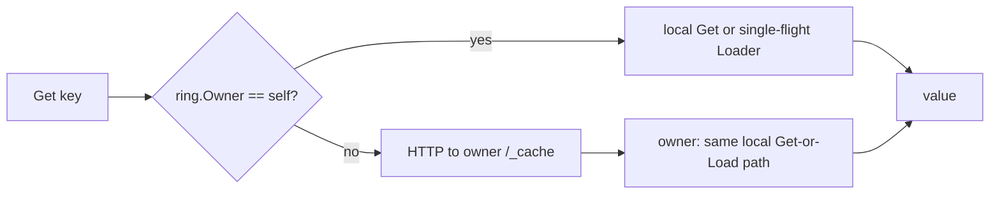

# cache-cluster — feature cookbook

Exhaustive, example-driven reference for every exported identifier in
`github.com/ubgo/cache-cluster` (package `clustercache`).

Import path:

```go
import clustercache "github.com/ubgo/cache-cluster"
```

`clustercache` adds peer-aware distribution on top of any
[`cache.Cache`](https://github.com/ubgo/cache) backend: a consistent-hash
**Ring** decides which **Node** owns a key, the owner fills it once
(single-flight) via a user **Loader**, and peers fetch from the owner over
HTTP. This is the groupcache pattern with the ubgo/cache interface — a hot key
is loaded **once cluster-wide**, regardless of node or goroutine count.

## Pages

- [Ring](ring.md) — `Ring`, `NewRing`, `Add`, `Remove`, `Owner`, `Peers`.
- [Node](node.md) — `Node`, `New`, the options, `Get`/`Set`/`Del`/`Has`/`Close`, `Handler`, `Loader`, and the peer-fill + single-flight semantics.

## Capability matrix

| Exported symbol | Kind | Page |
|---|---|---|
| `Ring` | type | [Ring](ring.md#ring) |
| `NewRing` | constructor | [Ring](ring.md#newring) |
| `(*Ring).Add` | method | [Ring](ring.md#add) |
| `(*Ring).Remove` | method | [Ring](ring.md#remove) |
| `(*Ring).Owner` | method | [Ring](ring.md#owner) |
| `(*Ring).Peers` | method | [Ring](ring.md#peers) |
| `Node` | type | [Node](node.md#node) |
| `New` | constructor | [Node](node.md#new) |
| `Option` | type | [Node](node.md#option) |
| `WithPeers` | option | [Node](node.md#withpeers) |
| `WithLoader` | option | [Node](node.md#withloader) |
| `WithFillTTL` | option | [Node](node.md#withfillttl) |
| `WithHTTPClient` | option | [Node](node.md#withhttpclient) |
| `Loader` | type | [Node](node.md#loader) |
| `(*Node).Get` | method | [Node](node.md#get) |
| `(*Node).Set` | method | [Node](node.md#set) |
| `(*Node).Del` | method | [Node](node.md#del) |
| `(*Node).Has` | method | [Node](node.md#has) |
| `(*Node).Close` | method | [Node](node.md#close) |
| `(*Node).Handler` | method | [Node](node.md#handler) |

## Topology


