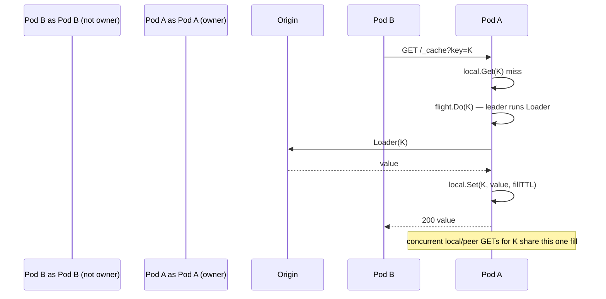

# Node — a cluster member

A `Node` owns the keys the ring assigns to it (filled once via the `Loader`,
deduped by single-flight) and proxies other keys to their owner over HTTP.

**Routing invariant:** every operation resolves `ring.Owner(key)`. Owned keys
hit the local `cache.Cache`; non-owned keys are proxied to the owner's base URL
(`/_cache?key=...`). The loader **only ever runs at a key's owner**, so a hot
key is loaded exactly once cluster-wide regardless of node or goroutine count.

```go
ctx := context.Background()
```

### Node

`type Node struct { ... }`

What it is: one cluster member. Construct with `New`; expose `Handler()` so
peers can reach it.

### New

`func New(self string, local cache.Cache, opts ...Option) *Node`

What it is: builds a node with id `self` backed by a local `cache.Cache`.
`self` is added to the ring immediately, so a single-node cluster owns every
key and works before any `WithPeers` call.

Use cases:

- Single-node now, grow to a cluster later (no code change).
- Wrap any backend (`cache-mem`, `cache-redis`, …) with cluster routing.

```go
import (
	memcache "github.com/ubgo/cache-mem"
	clustercache "github.com/ubgo/cache-cluster"
)

n := clustercache.New("node-a", memcache.New(),
	clustercache.WithPeers(map[string]string{
		"node-a": "http://10.0.0.1:8080",
		"node-b": "http://10.0.0.2:8080",
	}),
	clustercache.WithLoader(func(ctx context.Context, key string) ([]byte, error) {
		return loadFromOrigin(ctx, key)
	}),
	clustercache.WithFillTTL(5*time.Minute),
)
defer n.Close()
```

### Option

`type Option func(*Node)` — the functional-option type used by `New`.

### WithPeers

`func WithPeers(peers map[string]string) Option`

What it is: sets the full membership as `id -> base URL` (must include
`self`). Each id is added to the ring; the map is used to resolve an owner's
base URL when proxying. An "unknown owner" error means the ring and this map
disagree (a misconfigured `WithPeers`).

Use cases:

- Static membership from config / service discovery snapshot.

```go
clustercache.WithPeers(map[string]string{
	"node-a": "http://10.0.0.1:8080",
	"node-b": "http://10.0.0.2:8080",
	"node-c": "http://10.0.0.3:8080",
})
```

### WithLoader

`func WithLoader(l Loader) Option`

What it is: sets the read-through loader used **at a key's owner** on a miss.
Without it, a miss is simply `cache.ErrNotFound`.

Use cases:

- Read-through against a database / origin service with herd protection.

```go
clustercache.WithLoader(func(ctx context.Context, key string) ([]byte, error) {
	return db.Fetch(ctx, key)
})
```

### WithFillTTL

`func WithFillTTL(d time.Duration) Option`

What it is: the TTL applied when a loaded (or peer-`PUT`) value is stored
locally. `0` = no expiry.

Use cases:

- Bound staleness of read-through values.

```go
clustercache.WithFillTTL(2 * time.Minute)
```

### WithHTTPClient

`func WithHTTPClient(c *http.Client) Option`

What it is: overrides the client used for peer requests (default: 5s timeout).

Use cases:

- Custom timeouts, transport, TLS, or connection pooling for peer traffic.

```go
clustercache.WithHTTPClient(&http.Client{Timeout: 2 * time.Second})
```

### Loader

`type Loader func(ctx context.Context, key string) ([]byte, error)`

What it is: fills a key at its owning node on a miss. Required for
read-through. Runs owner-only and is single-flighted, so concurrent requests
(local or proxied from peers) for the same key collapse into one call.

Use cases:

- Any expensive origin fetch you want deduplicated cluster-wide.

```go
var l clustercache.Loader = func(ctx context.Context, key string) ([]byte, error) {
	return renderExpensiveReport(ctx, key)
}
```

### Get

`func (n *Node) Get(ctx, key) ([]byte, error)`

What it is: returns the value, fetching from the owning peer over HTTP if this
node is not the owner, and load-filling **once** at the owner on a miss
(single-flight). A non-`ErrNotFound` backend error propagates as-is — only a
genuine miss falls through to the loader. The re-check inside the flight avoids
a redundant loader call when a previous flight just filled the key.

Use cases:

- Cluster-wide read-through with one origin load per hot key.

```go
v, err := n.Get(ctx, "report:2026-05")
if errors.Is(err, cache.ErrNotFound) { /* no loader / origin miss */ }
```

### Set

`func (n *Node) Set(ctx, key, val) error`

What it is: stores `key` at its owner — locally if owned (with `WithFillTTL`),
otherwise via an HTTP `PUT` to the owner.

```go
_ = n.Set(ctx, "user:42", []byte("v"))
```

### Del

`func (n *Node) Del(ctx, key) error`

What it is: deletes `key` at its owner (local or HTTP `DELETE`).

```go
_ = n.Del(ctx, "user:42")
```

### Has

`func (n *Node) Has(ctx, key) (bool, error)`

What it is: presence check, owner-routed. **Does not trigger the loader** (a
proxied `Has` is a GET to the owner; 404 → `false`).

```go
ok, _ := n.Has(ctx, "user:42")
```

### Close

`func (n *Node) Close() error`

What it is: closes the local backend.

```go
defer n.Close()
```

### Handler

`func (n *Node) Handler() http.Handler`

What it is: the HTTP handler peers use to reach this node. Mount it at the base
URL advertised in `WithPeers`. Routes on `/_cache?key=...`:

- `GET` → value (200), or 404 if absent / no loader. **A GET for a key this
  node owns load-fills via the `Loader`, exactly like a local `Get`** — that is
  what makes peer fill (and its single-flight) work.
- `PUT` → store the request body (204).
- `DELETE` → delete (204).

Use cases:

- Expose the peer endpoint on each node's HTTP server.

```go
mux := http.NewServeMux()
mux.Handle("/_cache", n.Handler())
go http.ListenAndServe(":8080", mux)
```

## Peer-fill + single-flight, end to end


